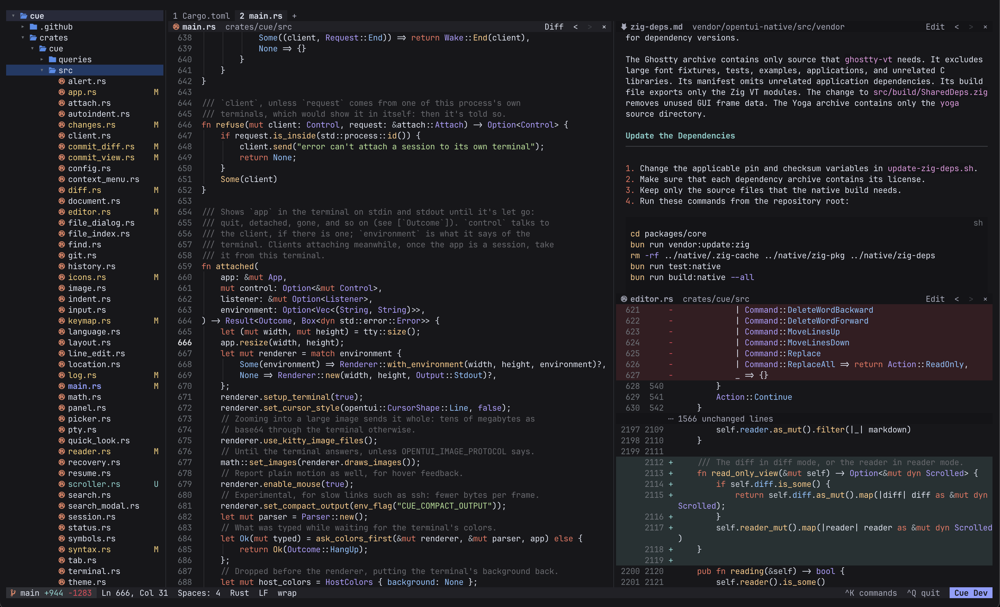

# cue

a tui code editor



**installation**

```bash
curl -fsSL https://s3.ianhuang.dev/cue/install.sh | bash
```

**features**

- first-class mouse support
- project-wide tree sitter
- multi panel editing
- on-keystroke `ripgrep` search
- terminal buffers
- markdown reader mode; LaTeX equation support
- detachable sessions (similar to `tmux`)
- multiple themes
- customizable keybinds
- git integration
- single-binary, zero dependencies

**requirements**

- supported terminals: [kitty](https://sw.kovidgoyal.net/kitty/), [ghostty](https://ghostty.org/), [iterm2](https://iterm2.com/)
- supported platforms: macOS arm64, linux x86_64